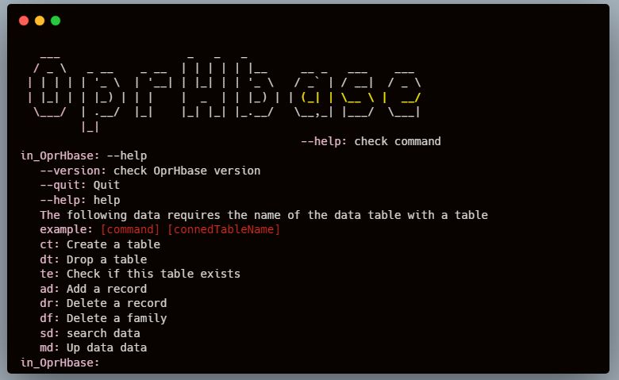

<h1 align="center">rhodeinae</h1>

<p align="center">
    <a href="https://www.apache.org/licenses/LICENSE-2.0"></a> 
    <a href="https://www.java.com/"></a>
    <a href="https://maven.apache.org/"></a> 
    <a href="https://hadoop.apache.org/"></a> 
    <a href="https://hbase.apache.org/"></a> 
</p>

<p align="center">
    
</p>

## Repository Introduction

Please wait for improvement. This is a Java program for remote operation of Hbase.



## Install

This project uses [Java](https://www.java.com/) [Git](https://git-scm.com/) [Hbase](https://hbase.apache.org/), Go check them out if you don't have them locally installed.

```shell
$ git clone https://github.com/weiensong/oprHbase.git
```

## Usage
```shell
# May be specified as a package
# set your hdfs info at HadoopInfo in utils package

$ javac LocalRun.java
$ java LocalRun
```


## Related Repository

- [hadoop](https://github.com/apache/hadoop) — Apache hadoop
- [hbase](https://github.com/apache/hbase) — Apache hbase


## Related Efforts

- [hadoop](https://hadoop.apache.org/)
- [hbase](https://hbase.apache.org/)


## Maintainers

[@weiensong](https://github.com/weiensong)


## Contributing

Feel free to dive in! [Open an issue](https://github.com/weiensong/oprHbase/issues) or submit PRs.

Standard Java follows the [Google apache](https://google.github.io/styleguide/javaguide.html) Code of Conduct.

### Contributors
This project exists thanks to all the people who contribute.


## License

[MIT](https://github.com/weiensong/oprHbase/blob/master/LICENSE) © weiensong

